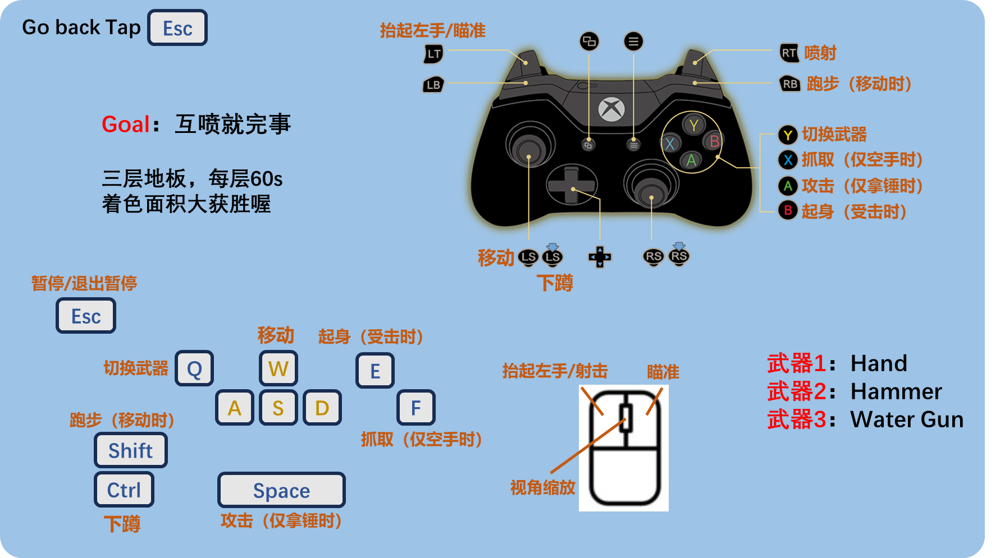

# Blustoon

IEG Morefun Studio Supernova project

Author: Siyan Zhu (Okifu)

## Fast Forward
Video: [Fast Forward](https://youtu.be/5yirauGsRxo)

## Game Content

缝合***Animal Party***和***Splatoon***：Blustoon = Animal Party + Splatoon ！

有2个玩家，1P2P，**游戏目标**是尽可能多的用喷枪染色！（喷就完事）

除了喷枪，还有武器锤子，两者都可以阻碍对方的行动喔~

共有三关，每关倒计时60s，时间结束地板会破碎，掉到下一关。
三关结束后触发结算界面~

> 游戏机制较多，可以慢慢发掘~~

**从技术上，该项目试图融合：**
- 类似Animal Party或Human Fallflat的Active Ragdoll，重点解决可控性，操作流畅度与物理效果的平衡。部分参考[GDC2020 Star War](https://www.youtube.com/watch?v=TmAU8aPekEo)
- 类似Splatoon的墨水系统，包含渲染与物体表面染色。该部分技术直接来源为[GDC2020 Bleeding Edge Effects](https://www.youtube.com/watch?v=c7HBxBfCsas)，Mix and Jam在Youtube有[教程](https://www.youtube.com/watch?v=FR618z5xEiM)。

## Game Control

